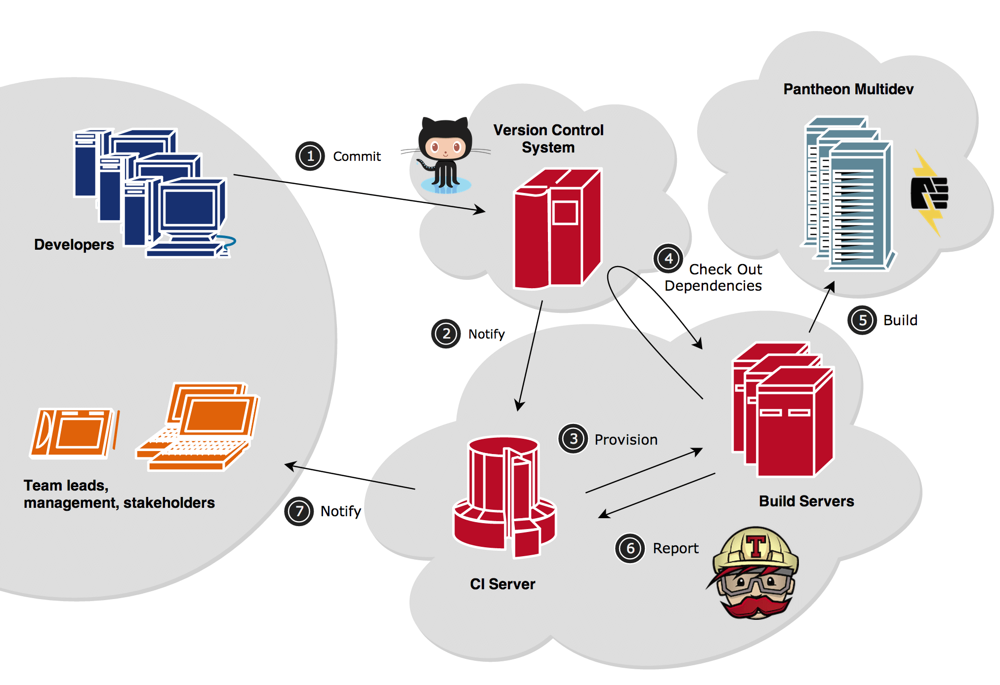
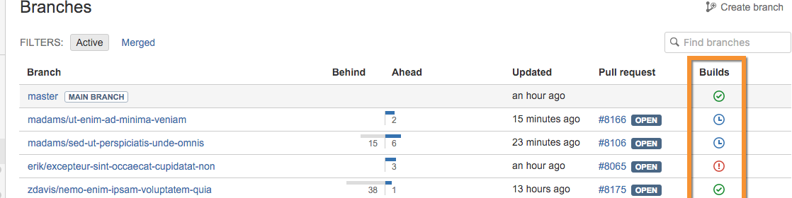
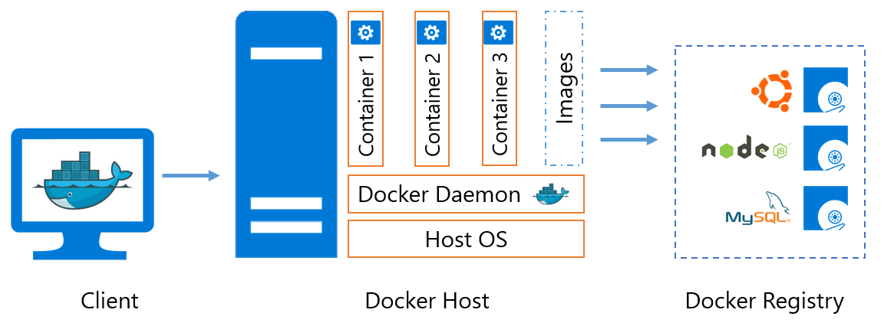
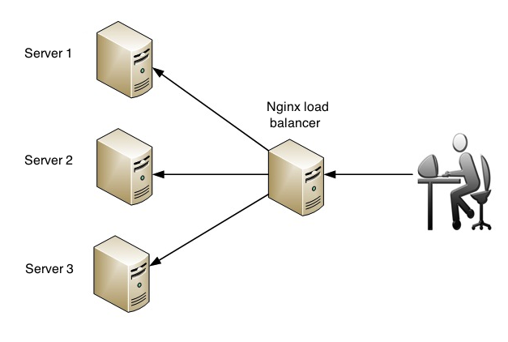

---

layout: sc5

style: |
  #Cover {
    background: #00B2FC url(pictures/deploy.png) no-repeat 50% 0%;
    background-size:contain;
  }
    #Cover h2 {
        margin:30px 0 0;
        color:#FFF;
        text-align:center;
        font-size:70px;
        opacity: 0;
        }
    #Cover p {
        margin:10px 0 0;
        text-align:center;
        color:#FFF;
        font-style:italic;
        font-size:20px;
        }
    #Cover p a {
      color:#FFF;
    }
    #Cover img {
      max-width: 150%;
    }
    #docker img {
      position: absolute;
      width: 80%;
    }
    #CI img {
      width: 90%;
      display: block;
      margin: 0 auto;
    }
    #end img {
      width: 90%;
      margin-top:-10px;
    }
    #Test img {
      width: 45%;
      margin: 0 auto;
      display: block;
    }
    #Picture h2 {
        color:#FFF;
        }
    #SeeMore h2 {
        font-size:100px
        }
    #SeeMore img {
        width:0.72em;
        height:0.72em;
        }
    pre code::before {
      display: none;
    }
    .slide pre {
    background-color: #f8f8f8;
    border: 1px solid #ffcb94;
    margin-bottom: 1.5rem;
  }
    .slide pre code.language-markup {
    display: block;
    overflow-x: auto;
    padding: 0.5em;
    color: #333;
    background: #f8f8f8;
    line-height: 1.4;
    font-size: 18px;
  }
    h3 {
        font-size: 1.25em;
        font-weight: bold;
    }
    .no-title h2 {
      display: none;
    }
    .big {
        font-size: 100px;
    }
    .middle {
        font-size: 60px;
    }
    #ooo img {
      width: 90%;
      display: block;
      margin: 0 auto;
      margin-top: -40px;
    }
    #PR img {
      width: 90%;
      display: block;
      margin: 40px auto;

    }

---

# Деплой {#Cover}

## Continuous Integration and Deployment

* …Сборка
* …Отправка кода в продакшн окружение
* …Запуск

## CI {#ooo}

## Для чего используется CI

* Сборки кода проекта
* Прогон тестов
* Оповещение заинтересованных людей
* CI Servers: TeamCity, Jenkins, TravisCI

<!--
* Непрерывная интеграция (англ. Continuous Integration) — это практика разработки программного обеспечения, которая заключается в выполнении частых автоматизированных сборок проекта для скорейшего выявления и решения интеграционных проблем.

* С практической точки зрения это значит, что в любой момент времени у вас должна быть «живая актуальная версия продукта», которую можно протестировать или продемонстрировать.
Для этого нужно:
Чтобы разработчики вносили свой код в VCS по крайней мере каждый день
Сборка продукта происходила в автоматическом режиме
Выкладка продукта (в том числе, обновление базы данных) происходила в автоматическом режиме
Тестирование продукта происходило в автоматическом режиме (насколько это возможно)
-->

## Тесты {#Test}

## Тесты

* модульное тестирование (unit-тесты, jasmine, mocha, chai, sinon)
* интеграционное тестирование (selenium)
* системное тестирование
* нагрузочное тестирование
* тестирование верстки (gemini)

## Pull Request {#PR}

## Зачем нужен деплой?
* Автоматизация выкладки релиза
* Скорость
* Возможность откатывать изменения

## Транспорт
* FTP, SSH, GIT // протоколы
* scp, rsync, capistrano // програмулины
* tar.gz, deb, docker // пакеты
* chef, ansambly... // наливайки

## Docker {#docker}

## Dockerfile

~~~ markup
FROM    centos:centos6

# Enable Extra Packages for Enterprise Linux (EPEL) for CentOS
RUN     yum install -y epel-release
# Install Node.js and npm
RUN     yum install -y nodejs npm

# Install app dependencies
COPY package.json /src/package.json
RUN cd /src; npm install --production

# Bundle app source
COPY . /src

EXPOSE  8080
CMD ["node", "/src/index.js"]
~~~

## Деплой {#CI}

## Проблемы деплоя?
* Сложность настройки
* Количество серверов
* Недоступность сервиса в момент деплоя

## Запуск

* Остановить
* Запустить
  * Очистка кеша
  * Миграции
  * Прогрев кеша
  * Запуск

## Один сервер: все просто

* Копирование по FTP
* Для крутых - SCP
* Git

## Первая кровь: два сервера

* Копирование по FTP
* Деплой занимает больше времени

## Внутри одного окружения
  * 2 версии в проде
  * конфликты

## Полная наливка сервера и отключение старого (балансер nginx)
  * создает новую ноду, наливает её
  * переключает весь трафик на ноду #2
  * вырубает ноду #1 когда весь исходящий трафик ушел

## Nginx balancer

## Прод без багов {#end}

